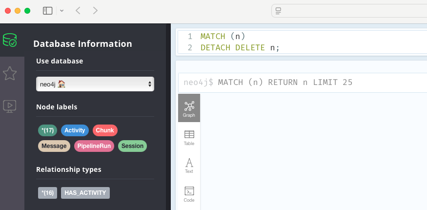

## Emptying a Neo4j database
To delete all data from a Neo4j database, you can use a **Cypher query** that removes all nodes and relationships. Here’s how to do it:

### Cypher Query to Delete All Data
Run this query to delete all nodes and relationships in the database:

```cypher
MATCH (n)
DETACH DELETE n;
```




### Explanation
- `MATCH (n)`: Finds all nodes in the database.
- `DETACH DELETE n`: Deletes the nodes and any relationships attached to them.

### Methods to Run the Query

1. **Neo4j Browser**:
   - Open the Neo4j Browser.
   - Type or paste the query into the query editor.
   - Execute the query by pressing Enter.

2. **Neo4j CLI**:
   - Use the Cypher Shell to connect to your Neo4j instance.
   - Run the command:
     ```bash
     cypher-shell -u <username> -p <password> "MATCH (n) DETACH DELETE n;"
     ```

3. **Programmatically**:
   - If you're using a Neo4j driver (Python, JavaScript, etc.), execute the above query in your application code.

   Example in Python (using `neo4j` library):
   ```python
   from neo4j import GraphDatabase

   uri = "bolt://localhost:7687"  # Adjust for your setup
   driver = GraphDatabase.driver(uri, auth=("username", "password"))

   def delete_all_data(tx):
       tx.run("MATCH (n) DETACH DELETE n")

   with driver.session() as session:
       session.write_transaction(delete_all_data)

   driver.close()
   ```