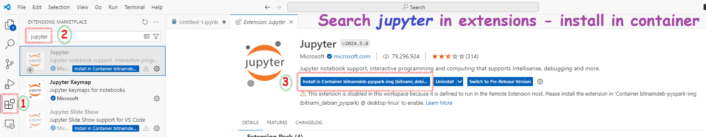
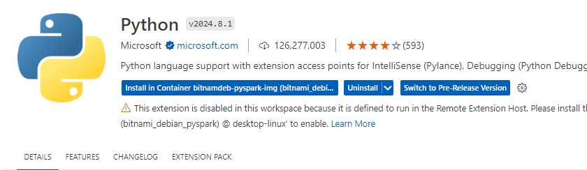
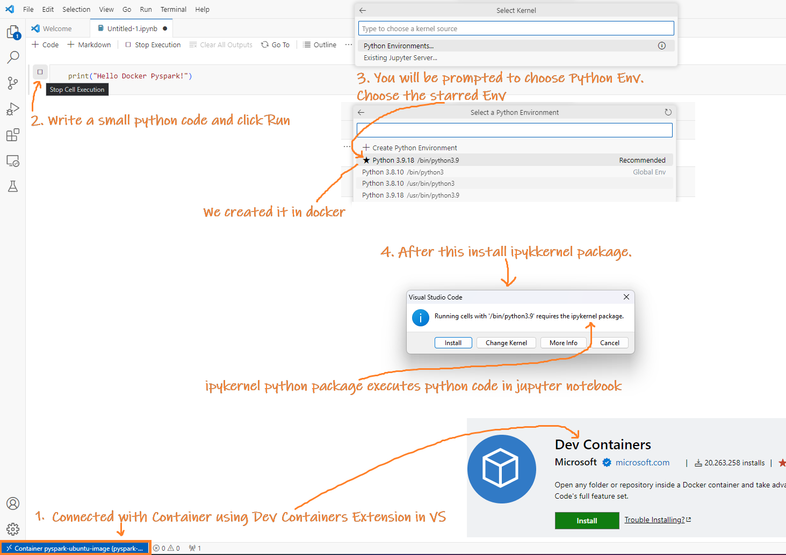
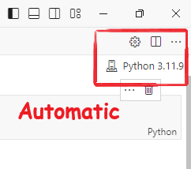

# 4.3\_VSCode\_Docker\_Connection

* [Connect to docker container from Visual Studio Code](4.3_VSCode_Docker_Connection.md#connect-to-docker-container-from-visual-studio-code)
  * [Summary of Steps](4.3_VSCode_Docker_Connection.md#summary-of-steps)
  * [Install Dev Containers Extension](4.3_VSCode_Docker_Connection.md#install-dev-containers-extension)
  * [Attach to the running container](4.3_VSCode_Docker_Connection.md#attach-to-the-running-container)
  * [Install Jupyter notebook support extension in conatiner](4.3_VSCode_Docker_Connection.md#install-jupyter-notebook-support-extension-in-conatiner)
  * [Install Python Support Extension in Container](4.3_VSCode_Docker_Connection.md#install-python-support-extension-in-container)
  * [Install ipykernel](4.3_VSCode_Docker_Connection.md#install-ipykernel)
  * [Install py4j(if required)](4.3_VSCode_Docker_Connection.md#install-py4jif-required)
  * [Errors](4.3_VSCode_Docker_Connection.md#errors)
    * [failed: mkdir -p /.vscode-server](4.3_VSCode_Docker_Connection.md#failed-mkdir--p-vscode-server)
      * [Correct Method](4.3_VSCode_Docker_Connection.md#correct-method)
      * [Wrong Resolution](4.3_VSCode_Docker_Connection.md#wrong-resolution)
        * [Add user:root method](4.3_VSCode_Docker_Connection.md#add-userroot-method)
        * [docker run -u root method](4.3_VSCode_Docker_Connection.md#docker-run--u-root-method)
    * [No Kernel Visible](4.3_VSCode_Docker_Connection.md#no-kernel-visible)
    * [Py4J Error](4.3_VSCode_Docker_Connection.md#py4j-error)

## Connect to docker container from Visual Studio Code

Here, I will show you how to connect to a container using VS Code to run Python code, create Jupyter notebooks, and more. This setup is very helpful. Containers are essentially Linux OS environments, and you can't log into them directly to install VS Code.

The connection is mainly done using the VS Code Dev Containers extension, which is the key component for connectivity. The following sections provide detailed steps to guide you through the process.

#### Summary of Steps

1. **Install VS Code Dev Containers Extension** on your local machine.
2.  Open a terminal and run the following commands in the container:

    ```bash
    sudo su
    mkdir -p /.vscode-server
    chmod -R 777 /.vscode-server
    ```
3. **Attach to the Running Container:** Open a remote window from the bottom left corner in VS Code.
4. **Install Jupyter & Python extensions** in the container.
5.  **Install Required Python Packages:** Open a terminal and run the following commands in the container:

    ```bash
    sudo su
    pip install ipykernel
    pip install py4j
    ```

### Install Dev Containers Extension

In **Visual Studio Code** press **Ctrl+Shift+X**, search **Dev Containers** and **install**. 

### Attach to the running container

*   Click the **Open Remote Window** button in the bottom-left corner of VS Code and select **Attach to Running Container** from the command palette that appears.

    
* Pick your active container from the presented list.


Note: Here you will encounter like this, go to the errors section to resolve it

### Install Jupyter notebook support extension in conatiner

Go to extensions(left pane), search Jupyter, click on Install in container



### Install Python Support Extension in Container

Go to extensions(left pane), search Python, click on Install in container



### Install ipykernel

Connect to the container from terminal(or EXEC in Docker container) and run this command:

```bash
sudo su
pip install ipykernel
```

Also, if you try to run a jupyter notebook, using the steps below



You may be prompted to isntall the extension:


### Install py4j(if required)


### Errors

#### failed: mkdir -p /.vscode-server

When trying to attach to a Docker container using the VSCode Dev extension, you may encounter an error during the **Installing VS Code Server step**:


**Reason:** Insufficient permissions for VSCode to create a folder **.vscode-server** inside the root folder. It cannot create this folder: **/.vscode-server**.

For example, when it runs this command:

```sh
mkdir -p /root/.vscode-server/bin/
```

**Note:**\
When you attach to a running container, the Dev Container extension installs a remote server in the `.vscode-server` folder, defaulting to the root location. You can change this property by using:

**User Settings (JSON):** Press `Ctrl+Shift+P` > "Preferences: Open User Settings (JSON)". Add:

```json
"remote.SSH.serverInstallPath": {
    "<host>": "/test/location"
}
```


**Settings UI:** Go to File > Preferences > Settings, filter by `@ext:ms-vscode-remote.remote-ssh install`, and under "Server Install Path" > Add Item with Item = `<host>` and Value = `/test/location`.


**Correct Method**

The correct method is to create the folder using the root user and provide permissions to it for the normal user. This way, you can create a normal container without needing to add the root user to the container.

To achieve this run the following commands in the container and then try to connect VS code again:

```bash
sudo su
mkdir -p /.vscode-server
chmod -R 777 /.vscode-server
```

> sometimes, e.g. in debian, just su


> Note: You may not always have su access or password. To resolve it you may have to create a Dockerfile and users inside it with elevated permission. Refer to my BitnamiSparkCluster [article](3-BitnamiSparkClusterOnDocker.html) to create such containers.

**Wrong Resolution**

**Add user:root method**

If you use a docker-compose file to create the containers you can add `user: root` to every container.


**docker run -u root method**

Alternaively, you can start the container with root. This is feasible only for single containers.

`docker run -u root -it --name myCont theImageFileName /bin/bash`

#### No Kernel Visible

Install the Jupyter extension in the container.


Also, go to the Docker container and install ipykernel:

```sh
sudo su
pip install ipykernel
```


Then it will detect the kernel automatically.



#### Py4J Error

While running code, you may get this error:


**Install** **py4j** in the **container** to resolve it:

```sh
sudo su
pip install py4j
```

.png>)
