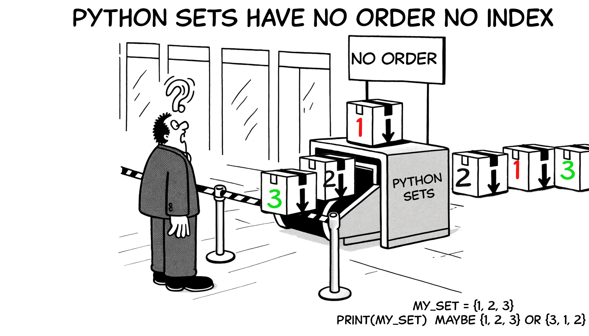
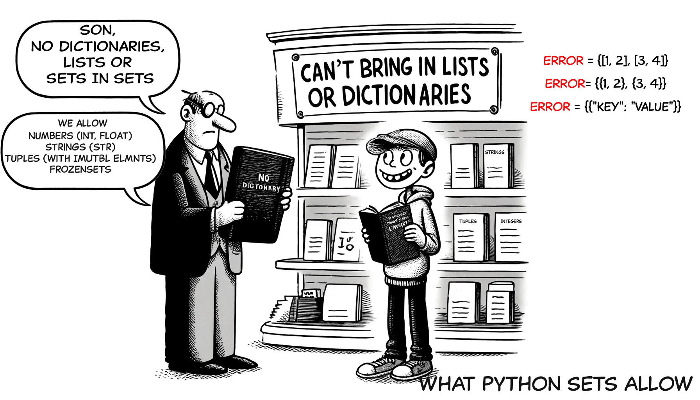
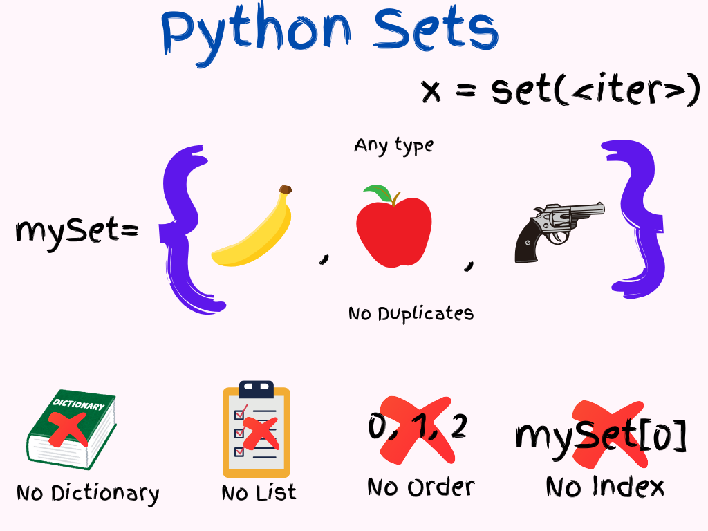

# 1.0\_Sets

<details>

<summary>Table of contents</summary>

{: .text-delta } 1. TOC {:toc}

</details>


## Python Sets for busy people

* Set items don't have a serial number (index)
* No Index. No Order. You can't refer to an item like `mySet[2]`
* No duplicate items
* No Lists/Dictionaries
* Can add new items:
  * `mySet.add(4)`: Adds a single element to the set.
  * `mySet.update([4, 5])`: Adds multiple elements to the set.
* Can remove items:
  * `mySet.remove(element)`: Removes a specific element. Raises a `KeyError` if not found.
  * `mySet.discard(element)`: Removes a specific element. No issues if not found.
  * `mySet.pop()`: Removes and returns a random element. `KeyError` if set empty.
  * `mySet.clear()`: Removes all elements. Slate clean.
* Check if an element exists:
  * `element in mySet`: `True` if item present, else `False`.
* Get the number of elements:
  * `len(mySet)`: Total no of items in set.
* Copy a set:
  * `mySet.copy()`: Creates a shallow copy of the set.
* Union of sets:
  * `mySet.union(other_set)` or `mySet | other_set`: Combines all elements from both sets, without duplicates.
* Intersection of sets:
  * `mySet.intersection(other_set)` or `mySet & other_set`: Returns elements common to both sets.
* Difference of sets:
  * `mySet.difference(other_set)` or `mySet - other_set`: Returns elements in the first set but not in the second.
* Symmetric difference of sets:
  * `mySet.symmetric_difference(other_set)` or `mySet ^ other_set`: Returns elements in either set, but not in both.

#### Note:

**Changeable items** (also called mutable) are items that can be modified after they are created. For example:

* **Lists**: You can add, remove, or change elements.
* **Dictionaries**: You can add, remove, or change key-value pairs.

These items cannot be added to a set because sets need items that do not change.

\


**Unchangeable items** (also called immutable) are items that cannot be modified after they are created. For example:

* **Numbers**: Once created, their values cannot be changed.
* **Strings**: Any modification creates a new string.
* **Tuples**: Their elements cannot be changed once created.

These items can be added to a set because their values stay the same.

\


## Python Sets

A Python set is like your travel kit. Collection of unique items. There can be different items. But, they should be unique.

**Set items don't have serial numbers (Index).** Without a serial number, you can't do something like `mySet[2]="Guava"`. All items in a set must be different. Otherwise, how would you tell them apart? If your set has two apples, which one is which? But, you can remove items from a set. You can take out an apple and add a guava. Don't think about removing an apple and adding another apple. Sets can't contain a `list` or a `dictionary`. Period. They can contain tuples, but these tuples can't have lists or dictionaries inside them. (It won't cause an error, but it can make the code unstable.)

### Python Sets Properties

So, here are some properties of Python Sets:

#### Items have No Index:

Python stores Set items but does not keep track of their order. This means there is no first item, second item, etc. For example, if you input `apple`, `orange`, `banana`, you might get `banana`, `apple`, `orange` as the output.



````
```python
mySet = {1, 2, 3}
print(mySet)  # Output could be {1, 2, 3} or {3, 1, 2} or any permutation

mySet[0] # THIS IS AN ERROR. No one is sitting at 0. There is no order, no index.
```
````

#### No Duplicates:

Since items in a set do not have serial numbers, duplicates are not allowed. If you try to add two apples, how would you distinguish between them? Therefore, when you add duplicates to a set, Python automatically removes the duplicates.


```python
mySet = {1, 2, 2, 3}
print(mySet)  # Output: {1, 2, 3}
```

#### No In-Place Replace. Add/remove instead.

You can add/remove items, but can't change an item's value directly. Can't in-place replace items. First, remove the old one and add the new one.


````
```python
mySet = {1, 2, 3}

mySet.remove(2) # OK
mySet.add(4) # OK
mySet[0] = 5 # ERROR
```
````

#### No Lists/Dictionaries, Tuples Are OK.

Sets use hashing, so you can't store lists or dictionaries in them. However, you can store tuples. Just make sure these tuples don't contain lists or dictionaries inside them.



````
```python
# Valid elements
mySet = {1, "hello", (1, 2)} # TUPLES OK

# Invalid elements
mySet = {[1, 2], {"key": "value"}} # ERROR, NO LISTS, NO DICTS
```
````

### When to use sets



Sets for Python are very useful when you need keep unique items and do quick membership checks.

Here are some scenarios where sets are frequently used:

#### Removing Duplicates

* **Use Case**: When you need to ensure that a collection of elements contains no duplicates.
*   **Example**: Removing duplicates from a list.

    ```python
    items = [1, 2, 2, 3, 4, 4, 5]
    unique_items = list(set(items))  # [1, 2, 3, 4, 5]
    ```

#### Membership Testing

* **Use Case**: When you need to check if an element exists in a collection. Sets provide average O(1) time complexity for membership tests.
*   **Example**: Checking if an item exists in a collection.

    ```python
    allowed_items = {"apple", "banana", "cherry"}
    if "banana" in allowed_items:
        print("Banana is allowed")
    ```

#### Set Operations

* **Use Case**: When you need to perform operations like union, intersection, difference, and symmetric difference between collections.
*   **Example**: Finding common elements between two sets.

    ```python
    set1 = {1, 2, 3}
    set2 = {3, 4, 5}
    common_items = set1 & set2  # {3}
    ```

#### Data Validation

* **Use Case**: When validating data to ensure uniqueness, such as checking for duplicate entries in a dataset.
*   **Example**: Validating unique user IDs.

    ```python
    user_ids = [101, 102, 103, 101]
    unique_user_ids = set(user_ids)
    if len(user_ids) != len(unique_user_ids):
        print("Duplicate user IDs found")
    ```

#### Tracking Unique Elements

* **Use Case**: When you need to keep track of unique items encountered during processing.
*   **Example**: Tracking unique words in a text.

    ```python
    text = "hello world hello"
    words = text.split()
    unique_words = set(words)  # {"hello", "world"}
    ```

#### Efficient Data Lookups

* **Use Case**: When you need a data structure that allows for fast lookups, insertions, and deletions.
*   **Example**: Keeping track of visited URLs in a web crawler.

    ```python
    visited_urls = set()
    visited_urls.add("https://example.com")
    if "https://example.com" in visited_urls:
        print("URL already visited")
    ```

### Test your knowledge

Highlight the answer section to reveal!

#### Question - set.update()

What will be the output of the following statement?

```python
thisset = {"apple", "banana", "cherry", False, True, 0}
print(thisset)
```

**Answer:** {'apple', 'banana', 'cherry', False, True}

#### Question - set.add()

What will be the output of the following statement?

```python
thisset = {"apple", "banana", "cherry"}
thisset.add("apple")
print(thisset)
```

**Answer:** {'apple', 'banana', 'cherry'}

#### Question - set.discard()

What will be the output of the following statement?

```python
thisset = {1, 2, 3, 4, 5}
thisset.discard(6)
print(thisset)
```

**Answer:** {1, 2, 3, 4, 5}

#### Question - set.remove()

What will be the output of the following statement?

```python
thisset = {1, 2, 3, 4, 5}
thisset.remove(6)
print(thisset)
```

**Answer:** Raises a KeyError

#### Question - set.update()

What will be the output of the following statement?

```python
thisset = {"apple", "banana", "cherry"}
thisset.update(["orange", "mango"])
print(thisset)
```

**Answer:** {'apple', 'banana', 'cherry', 'orange', 'mango'}

#### Question - set.copy()

What will be the output of the following statement?

```python
thisset = {"apple", "banana", "cherry"}
newset = thisset.copy()
thisset.add("orange")
print(newset)
```

**Answer:** {'apple', 'banana', 'cherry'}

#### Question - set membership

What will be the output of the following statement?

```python
thisset = {1, 2, 3, 4, 5}
result = 3 in thisset
print(result)
```

**Answer:** True

#### Question - set intersection

What will be the output of the following statement?

```python
thisset1 = {1, 2, 3}
thisset2 = {3, 4, 5}
result = thisset1 & thisset2
print(result)
```

**Answer:** {3}

#### Question - set union

What will be the output of the following statement?

```python
thisset1 = {1, 2, 3}
thisset2 = {3, 4, 5}
result = thisset1 | thisset2
print(result)
```

**Answer:** {1, 2, 3, 4, 5}

#### Question - set difference

What will be the output of the following statement?

```python
thisset1 = {1, 2, 3}
thisset2 = {3, 4, 5}
result = thisset1 - thisset2
print(result)
```

**Answer:** {1, 2}

### Set Operations and Properties

| Operation                       | Syntax                                                                  | Description & Example                                                                                                                                                                                                            |
| ------------------------------- | ----------------------------------------------------------------------- | -------------------------------------------------------------------------------------------------------------------------------------------------------------------------------------------------------------------------------- |
| **Union**                       | <p><code>x1.union(x2)</code><br><code>x1 &#x26;#124; x2</code></p>      | <p>Combines all elements from both sets, without duplicates.<br><code>x1 = {1, 2, 3}</code><br><code>x2 = {3, 4, 5}</code><br><code>x1.union(x2)</code><br>Output: <code>{1, 2, 3, 4, 5}</code></p>                              |
| **Intersection**                | <p><code>x1.intersection(x2)</code><br><code>x1 &#x26; x2</code></p>    | <p>Returns elements common to both sets.<br><code>x1 = {1, 2, 3}</code><br><code>x2 = {3, 4, 5}</code><br><code>x1 &#x26; x2</code><br>Output: <code>{3}</code></p>                                                              |
| **Difference**                  | <p><code>x1.difference(x2)</code><br><code>x1 - x2</code></p>           | <p>Returns elements in the first set but not in the second.<br><code>x1 = {1, 2, 3}</code><br><code>x2 = {3, 4, 5}</code><br><code>x1 - x2</code><br>Output: <code>{1, 2}</code></p>                                             |
| **Symmetric Difference**        | <p><code>x1.symmetric_difference(x2)</code><br><code>x1 ^ x2</code></p> | <p>Elements in either set, but not both.<br><code>x1 = {1, 2, 3}</code><br><code>x2 = {3, 4, 5}</code><br><code>x1 ^ x2</code><br>Output: <code>{1, 2, 4, 5}</code></p>                                                          |
| **Subset**                      | <p><code>x1.issubset(x2)</code><br><code>x1 &#x3C;= x2</code></p>       | <p>Checks if all elements of one set are in another.<br><code>x1 = {1, 2}</code><br><code>x2 = {1, 2, 3}</code><br><code>x1 &#x3C;= x2</code><br>Output: <code>True</code></p>                                                   |
| **Superset**                    | <p><code>x1.issuperset(x2)</code><br><code>x1 >= x2</code></p>          | <p>Checks if one set contains all elements of another.<br><code>x1 = {1, 2, 3}</code><br><code>x2 = {1, 2}</code><br><code>x1 >= x2</code><br>Output: <code>True</code></p>                                                      |
| **Disjoint**                    | `x1.isdisjoint(x2)`                                                     | <p>Checks if two sets have no elements in common.<br><code>x1 = {1, 2, 3}</code><br><code>x2 = {4, 5, 6}</code><br><code>x1.isdisjoint(x2)</code><br>Output: <code>True</code></p>                                               |
| **Add Element**                 | `x1.add(element)`                                                       | <p>Adds a single element to the set.<br><code>x1 = {1, 2, 3}</code><br><code>x1.add(4)</code><br>Output: <code>{1, 2, 3, 4}</code></p>                                                                                           |
| **Remove Element**              | `x1.remove(element)`                                                    | <p>Removes a specific element from the set.<br><code>x1 = {1, 2, 3}</code><br><code>x1.remove(2)</code><br>Output: <code>{1, 3}</code></p>                                                                                       |
| **Discard Element**             | `x1.discard(element)`                                                   | <p>Removes a specific element if it is present.<br><code>x1 = {1, 2, 3}</code><br><code>x1.discard(2)</code><br>Output: <code>{1, 3}</code></p>                                                                                  |
| **Clear Set**                   | `x1.clear()`                                                            | <p>Removes all elements from the set.<br><code>x1 = {1, 2, 3}</code><br><code>x1.clear()</code><br>Output: <code>set()</code></p>                                                                                                |
| **Copy Set**                    | `x1.copy()`                                                             | <p>Creates a shallow copy of the set.<br><code>x1 = {1, 2, 3}</code><br><code>x2 = x1.copy()</code><br>Output: <code>x2 = {1, 2, 3}</code></p>                                                                                   |
| **Update Set**                  | `x1.update(x2)`                                                         | <p>Adds elements from another set.<br><code>x1 = {1, 2}</code><br><code>x2 = {3, 4}</code><br><code>x1.update(x2)</code><br>Output: <code>{1, 2, 3, 4}</code></p>                                                                |
| **Intersection Update**         | `x1.intersection_update(x2)`                                            | <p>Updates the set, keeping only elements found in it and another set.<br><code>x1 = {1, 2, 3}</code><br><code>x2 = {2, 3, 4}</code><br><code>x1.intersection_update(x2)</code><br>Output: <code>{2, 3}</code></p>               |
| **Difference Update**           | `x1.difference_update(x2)`                                              | <p>Updates the set, removing elements found in another set.<br><code>x1 = {1, 2, 3}</code><br><code>x2 = {2, 3, 4}</code><br><code>x1.difference_update(x2)</code><br>Output: <code>{1}</code></p>                               |
| **Symmetric Difference Update** | `x1.symmetric_difference_update(x2)`                                    | <p>Updates the set, keeping only elements found in either set, but not both.<br><code>x1 = {1, 2, 3}</code><br><code>x2 = {2, 3, 4}</code><br><code>x1.symmetric_difference_update(x2)</code><br>Output: <code>{1, 4}</code></p> |
