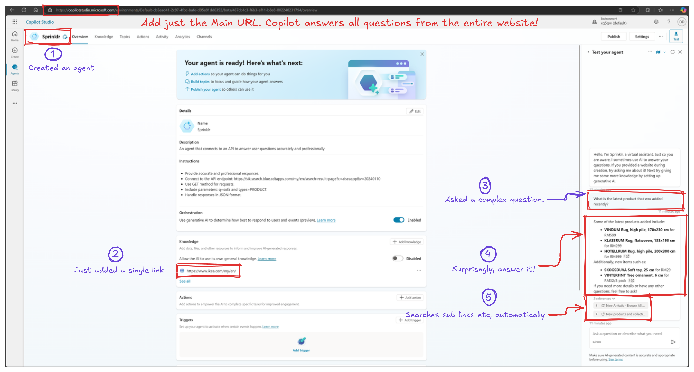

# How Coipiolt Works On-the-Fly with URLs

In Microsoft's copilot, when you add a URL to its knowledgesource, it can find any answer from the website. 

How does it do this  on-the-fly retrieval from a public website 
without any pre indexing or processing?

1. **User Query Understanding:**  
   When you enter a query or ask a question within Copilot’s interface, the system first attempts to interpret your request. This involves natural language processing (NLP) steps to understand the meaning, intent, and context of what you are asking.

2. **Dynamic Query Formulation:**  
   Once the user’s intent is understood, the Copilot system generates one or more internal search queries. These are often more structured or keyword-oriented than your original input. For instance, if you asked, “What are the design principles mentioned on the Acme Corporation’s documentation page?” the system might internally create queries such as:  
   - "Acme Corporation site:example.com design principles"  
   - "Acme documentation core design principles"  
   
   This step is all about converting a human-friendly question into queries that a search engine (Bing in this case) can effectively process.

3. **Integration with Bing Search:**  
   Microsoft Copilot leverages Bing Web Search APIs under the hood. However, the key difference from a normal web search is that Copilot scopes the search to the knowledge sources you have provided. If you added a public URL as a knowledge source, Copilot appends constraints so that Bing only retrieves results from that domain or URL range. For instance, if your knowledge source is `https://www.example.com/docs/`, the search might look like:  
   - "design principles site:https://www.example.com/docs/"

   This ensures Bing returns only relevant pages from the specified site, not from the entire web.

4. **Filtered Results:**  
   Bing returns a set of web results that match the restricted search. These are highly filtered, ensuring that Copilot’s result set remains anchored to the content you explicitly allowed. This might include documentation pages, FAQs, product manuals, or whatever the linked content contains.

5. **Content Extraction and Summarization:**  
   Copilot then parses the returned search results. Using large language model (LLM) capabilities, it can read through the retrieved content, identify the relevant sections that answer your question, and synthesize those findings into a coherent, human-readable response. Essentially, it’s performing a “distillation” step: extracting pertinent information, summarizing it, and merging it into a single, unified answer.

6. **Answer Generation and Refinement:**  
   Before providing the final answer to the user, Copilot may combine the filtered search results with its own inherent language model knowledge. It might also refine the wording for clarity, fill in contextual details, or incorporate other known data from its connected systems (e.g., your organizational documents, company policies, or other integrated knowledge sources).

7. **Final Response Delivery:**  
   The user sees a response that ideally feels like a direct, contextually aware answer to their question, backed by the trusted content in the specified URL or domain.

---

## Why Use Bing's Paid Search API Instead of Scraping Bing Directly?

Using the **official Bing Web Search API** (a paid service from Microsoft Azure) means you don't have to deal with captchas or being blocked by Bing. This is because you're accessing Bing's search results through an authorized channel with an API key.

Here's the difference:

1. **Using Bing Web Search API:**
  - **Pros:**  
    - Made for automated use.
    - No captchas, as Microsoft allows automated requests.
    - Reliable and stable results.
  - **Cons:**  
    - Costs money (after limited free trial).

2. **Scraping Bing Search Results (Without the API):**
  - **Pros:**
    - No direct costs.
  - **Cons:**
    - Bing may detect bots and issue captchas or block requests.
    - Scraping Bing directly violates their terms of service and can lead to rate-limits, IP bans, or captchas.

**Summary:** Using the official Bing Web Search API avoids captchas and blocking. Scraping Bing directly for free risks these issues.

## Still want to avoid any API cost?

If you want to avoid paid APIs and third-party indexing services, and you have basic OpenAI API access, your options are limited. Large language models don't have built-in web search capabilities and need external data. If you don't want to pay for a search API like Bing or Google Custom Search, and you don't want to build and maintain your own index, here are some alternatives:

1. Use the Website’s Native Search (If Available)
Many websites, like IKEA, have their own search functionality. For example, IKEA’s search page might be:
https://www.ikea.com/my/en/search/?q=YOUR_QUERY

Approach:

Send an HTTP GET request to that URL with your query.
The server returns an HTML page with search results.
Parse (scrape) that HTML to extract product descriptions or relevant text.
Pros:

It's free (no external API costs).
You use the site’s own search capabilities.
Cons:

You need to write code to parse HTML and extract text.
Results depend on the site’s search quality.
Some sites might limit automated scraping (check their robots.txt or policies).

[1] https://learn.microsoft.com/en-au/microsoft-copilot-studio/knowledge-copilot-studio
[2] https://learn.microsoft.com/en-au/microsoft-copilot-studio/knowledge-copilot-studio