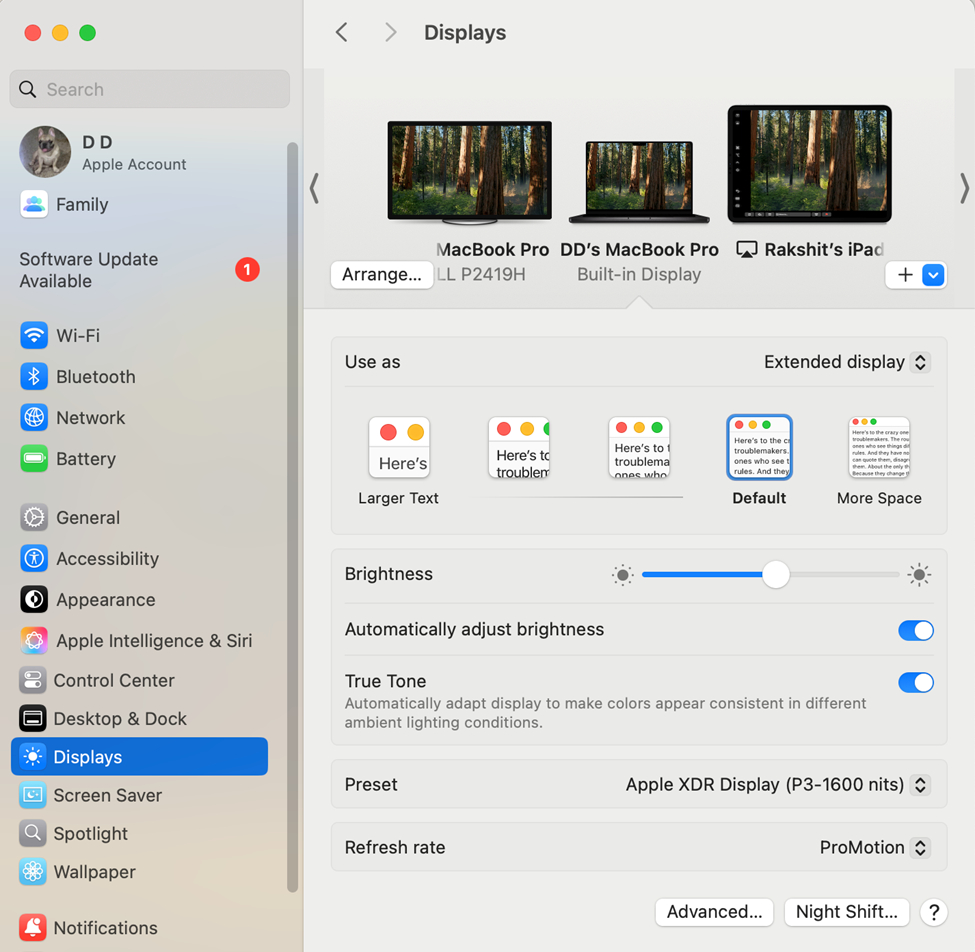
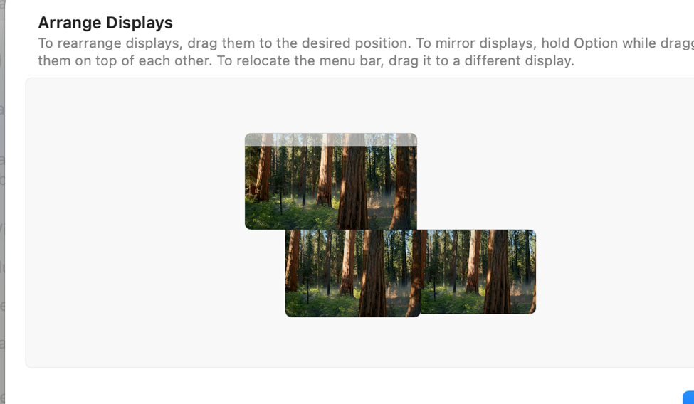
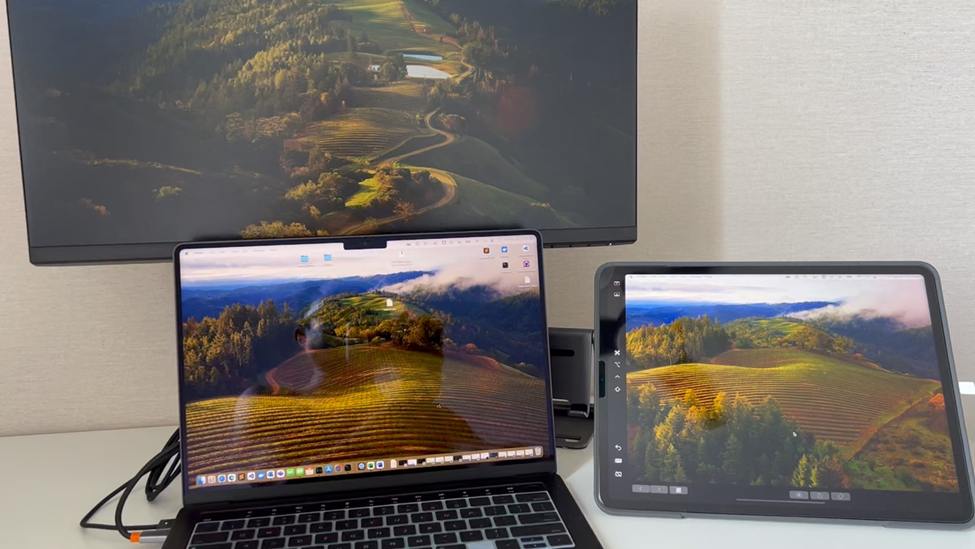

# Arranging Your MacBook Display Setup

To optimize your workspace, follow these steps to set up your MacBook as the main display and extend it to other monitors, including an iPad.

1. **Set the MacBook as the Main Display**: 
    - Open System Preferences > Displays.
    - Drag the white menu bar to the MacBook display to set it as the main display.

2. **Add the iPad as a Display**:
    - Click the plus sign (+) in the top right corner of the Displays window.
    - Select your iPad from the list of available devices.

3. **Arrange the Displays**:
    - Drag the display icons to arrange them in the following order:
      - **Top**: External monitor
      - **Middle**: MacBook
      - **Right**: iPad

Finally you will be able to move the cursor/window from one display to another in a logical manner. Like top to middle to right.

