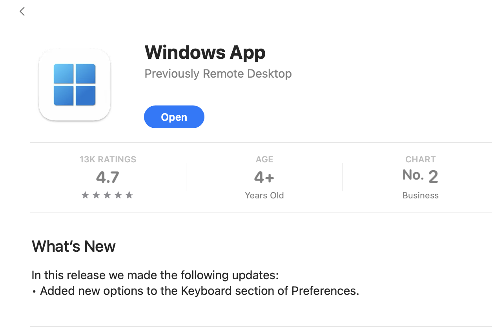
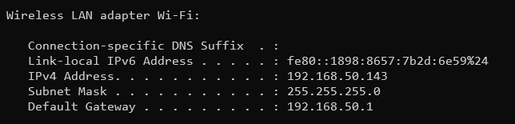
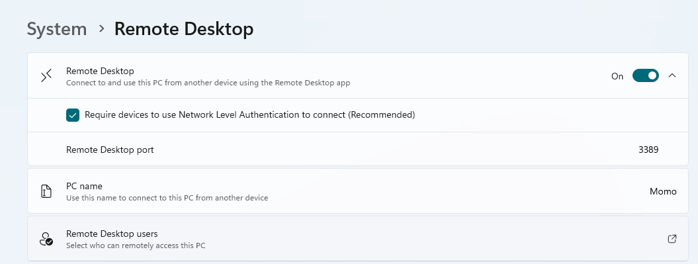
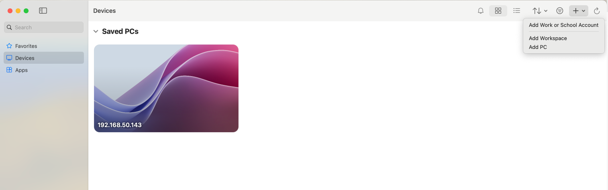
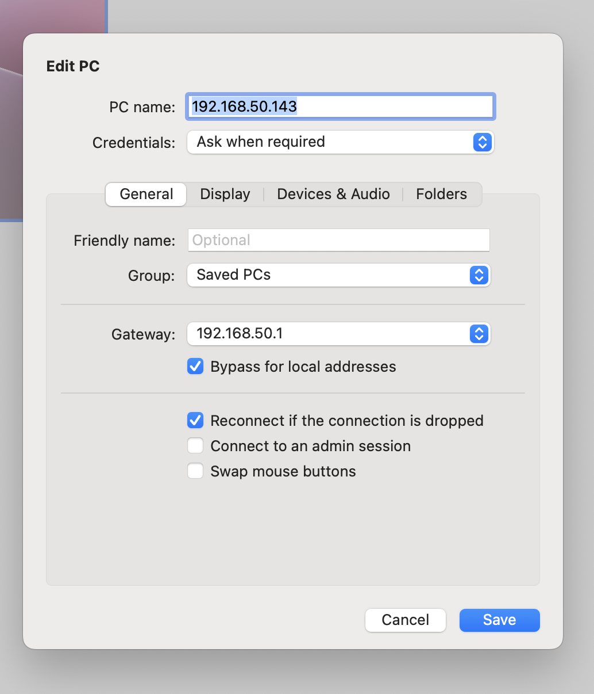
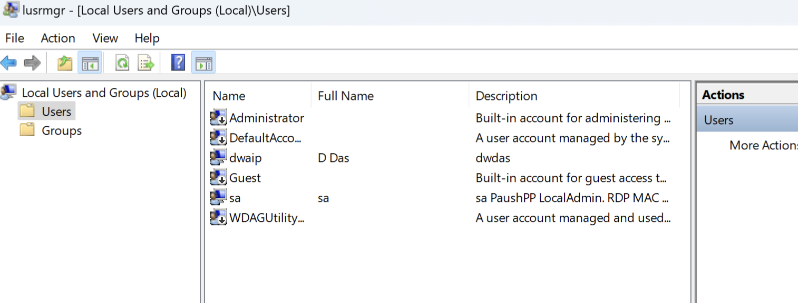

# MacToWindowsLocalRDP

#### Setting Up Remote Desktop Access on Windows

Follow these steps to configure and use the Windows Remote Desktop App for connecting to your Windows PC:

***

**1. Download the Windows Remote Desktop App**

* This app is now referred to as the **Windows App for RDP (Remote Desktop Protocol)**.
* 

***

**2. Find Your Windows PC's IP Address**

* Open the **Command Prompt** on your Windows computer and type `ipconfig`.
* This will display a list of network adapters.
* Look for the adapter with a **Default Gateway**—this is most likely your active network connection.
* For example, if you're using Wi-Fi, the **Wi-Fi network adapter** will have the Default Gateway.
* Note down the Default Gateway IP address as your target IP.
* 
* Example of a Wi-Fi adapter: 

***

**3. Enable Remote Desktop on Your Windows Machine**

* Ensure that **Remote Desktop** is enabled on your Windows PC.
* 

***

**4. Set Up the Remote Desktop App**

* Open the **Windows Remote Desktop App** on your device.
* Click on the **"Add PC"** button (the plus sign in the top-right corner).
*

    
* Fill in the required details:
  * **PC Name**: Enter the IP address you noted earlier.
  * **Account**: Choose to use either your Microsoft login (e.g., `dwaipayan.das@hotmail.com`) or a local account.
  * 

***

**5. Connecting to Your PC**

* Once configured, click **Connect**.
* If prompted with a **certificate warning**, you can safely ignore it and proceed.
* 

***

**6. Using a Local User Account**

* For local accounts, you can create one by typing `lusrmgr.msc` in the Run dialog (`Win + R`) on your Windows PC.
*

    
* If you encounter issues with Windows PIN login, consider disabling it for simplicity.

***

#### Benefits of This Setup

* **Seamless Integration**: Easily copy-paste files and text between your Mac and Windows PC.
* **Enhanced Multitasking**: Move the cursor across multiple monitors as if they were one continuous screen.

Enjoy this powerful setup for managing your Windows PC remotely with ease!
