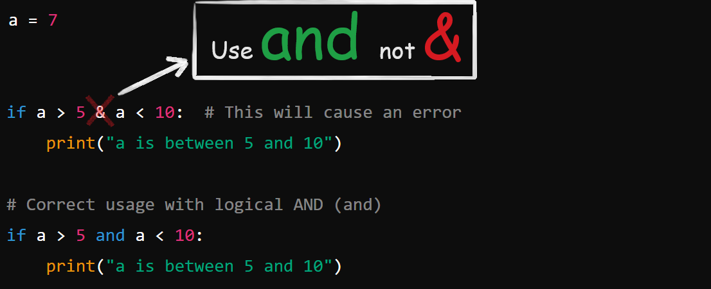

# (1 == "1") is False but (1 < "1") is ERROR Why?

When Python uses the `==` operator, it first checks if the two items are of the same type. If the types are different, Python will immediately return `False` without thinking twice. Hence, you get `False` and not an error.

But when Python uses relational operators like (`<`, `>`, `<=`, `>=`), it wants the items to be of the same type. Why? Because you can't compare oranges with apples! Relational comparisons need the items to be of the same type to decide the order.

#### Summary:

**Equality (`==`)**: Checks if the two values are the same type. Returns \`False\` if the types are different, without further comparison.

```
print(1 == "1")  # This will return False
  
```

\


**Relational Operators (`<`, `>`, etc.)**: Require the values to be of the same or comparable types to evaluate their order. Raise a \`TypeError\` if the types are not comparable.

```
print(1 < "1")   # This will raise a TypeError
  
```

\


**Use and not &**


