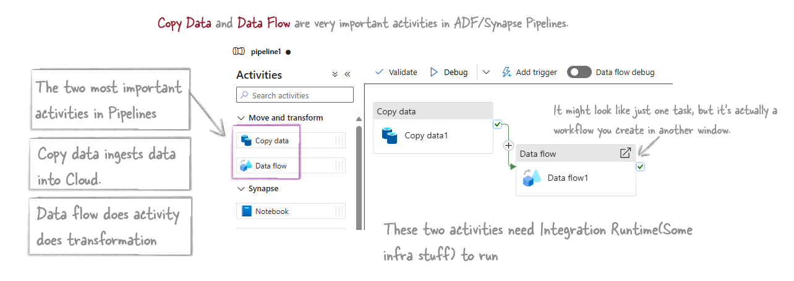
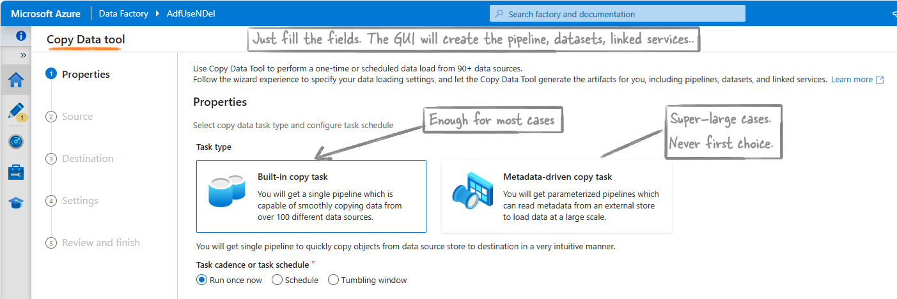

# 1.3\_ETL Pipelines

Table of contents

{: .text-delta } 1. TOC {:toc}

## Pipelines

Pipeline = Workflow = Collection of Activities\

## Activities

Activities = Steps/Tasks in a Pipeline

### [Copy data Activity](https://learn.microsoft.com/en-us/azure/data-factory/copy-activity-overview)

Copy data step/task copies data from here to there in the cloud. It's a `data import tool`. This is one of the most important activities in pipelines. Some projects have only this step doing all the work.

#### [Copy data tool](https://learn.microsoft.com/en-us/azure/data-factory/quickstart-hello-world-copy-data-tool)

The Copy data tool is a GUI to make the Copy data activity easier. Using this GUI you can create a pipeline using just Next, Next. It has two type of tasks.

[**Built-in copy task**](https://learn.microsoft.com/en-us/azure/data-factory/quickstart-hello-world-copy-data-tool)

This method is enough for almost all cases. It's the original method. Just click 'next' using the tool, and ADF will take care of everything else.

But, this is suitable for situations where we have fixed sources and fixed destinations.

**Example:** Copying Data between two Azure SQL Databases. Azure Blob storage to Azure SQL Databases etc.

[**Metadata-driven copy task**](https://learn.microsoft.com/en-us/azure/data-factory/copy-data-tool-metadata-driven)

This method is for very large and complex situations. For example, copying hundreds of tables from an on-prem SQL Server to Azure Data Lake Storage (ADLS), with the list of tables and their destinations managed in a control table.

**Example:** Imagine you have an on-premises SQL Server with hundreds of tables. You want to copy these tables to ADLS. Instead of creating individual copy tasks for each table, you create a control table that lists all the source tables and their corresponding destinations. ADF then uses this control table to dynamically copy each table to the specified destination.

### [Data flow Activity](https://learn.microsoft.com/en-us/azure/data-factory/transform-data)

This is also the most important activity in Pipelines. Using this you create the transformation work.

There are two types of Data flow activities:

* **Mapping Data Flows:** This is the common data flow activity which we usually use. Here we use a GUI to create data transformation steps. Azure runs these on a behind-the-scenes Spark cluster managed by Azure. [Learn more](https://learn.microsoft.com/en-us/training/modules/code-free-transformation-scale/4-author-azure-data-factory-mapping-data-flow).
* **Wrangling Data Flows:** Use Excel-like Power Query for data preparation, integrating with Power Query Online and using Spark for execution.

Now, if you want to bypass ADF and do your own coding, manage your own env etc you you can use these activities.

* **HDInsight Activities:** Use Hive, Pig, MapReduce, or Spark on your HDInsight cluster in Azure.
* **Databricks Activities:**
  * Notebook Activity
  * Jar Activity
  * Python Activity
* **Custom Activity:** Execute custom code or scripts.

**Note:** Data Flow activities run on Apache Spark clusters. Microsoft makes things easy by adding a GUI, but Dataflows are essentially Spark activities.

#### Other Activities

* **Azure ML Studio (Classic) Activity:** Execute machine learning pipelines.
* **Stored Procedure Activity:** Execute a stored procedure in a database.
* **Custom Activity:** Execute custom code or scripts.

#### Control Flow Activities

These activities control the execution flow of a pipeline.

* **If Condition Activity:** Execute different paths based on conditions.
* **For Each Activity:** Iterate over a collection of items.
* **Until Activity:** Repeat an activity until a condition is met.
* **Wait Activity:** Pause the pipeline execution for a specified duration.

#### Additional Activities

* **Web Activity:** Make HTTP requests.
* **Azure Function Activity:** Invoke an Azure Function.
* **Execute Pipeline Activity:** Call another pipeline.

### Integration Runtime

It's the infrastructure part. It provides the hardware and running environment, and it connects to on-premises systems or local laptops.

### Linked Service

These are connection strings or configurations that define how to connect to data sources or compute environments.

### Datasets

These represent the data that gets processed in the pipeline.
